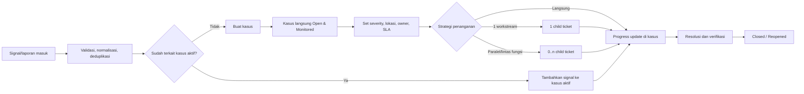
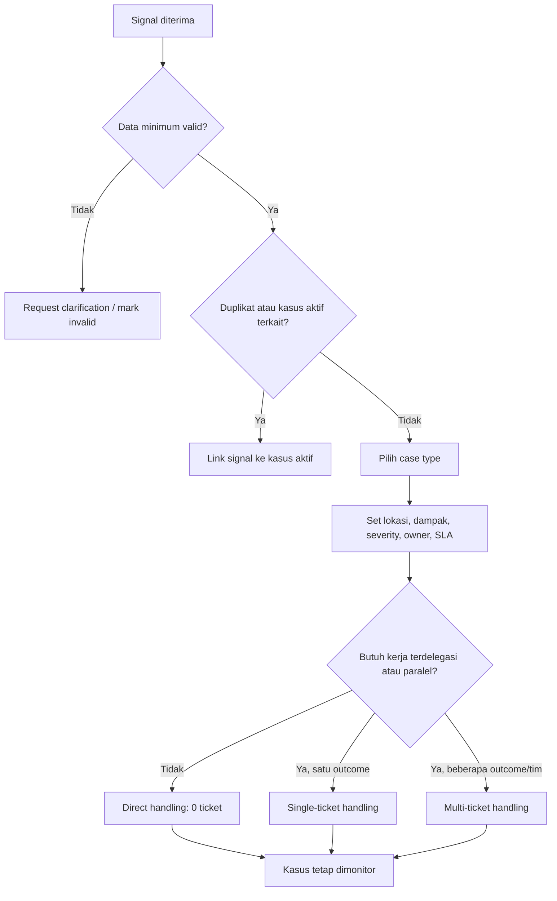

# MonitorMBG — Case-Centric Best-Case Workflow

## Prinsip desain

- Gunakan alur **signal → case**, bukan `signal → ticket → case`.
- **Case** adalah source of truth untuk monitoring, ownership, progress, SLA, dan closure.
- **Signal** adalah pemicu, bukti, atau informasi tambahan yang dapat ditautkan ke case aktif.
- **Ticket/action item** adalah item eksekusi opsional di bawah case.
- Satu case dapat memiliki **0, 1, atau banyak child ticket**.
- Case tidak tertutup otomatis hanya karena seluruh ticket selesai; owner wajib memverifikasi resolution.

## Recommended end-to-end workflow

1. Signal masuk melalui laporan manual, integrasi, hotline, audit, atau monitoring.
2. Sistem memvalidasi data minimum dan mengelompokkan signal duplikat.
3. Signal ditautkan ke case aktif yang relevan atau membuat case baru.
4. Saat case dibuat, statusnya langsung `Open & Monitored`; SLA mulai berjalan.
5. Sistem menetapkan severity, kandidat owner, lokasi, dan pihak yang perlu diberi tahu.
6. Owner melakukan assessment singkat, mencatat rencana penanganan, lalu memilih direct handling, single-ticket handling, atau multi-ticket handling.
7. Semua perubahan penting masuk ke timeline case.
8. Case ditutup setelah resolution diverifikasi dan bukti penanganan lengkap.

## Case lifecycle status

| Status | Arti | Transisi utama |
|---|---|---|
| `Open & Monitored` | Case telah terbentuk, SLA berjalan, perlu acknowledgement atau assessment. | `Assessing`, `In Handling`, `Escalated`, `Resolved` |
| `Assessing` | Validasi fakta, dampak, cakupan, dan rencana penanganan. | `In Handling`, `Pending / Blocked`, `Escalated`, `Resolved` |
| `In Handling` | Penanganan aktif, langsung atau melalui child ticket. | `Pending / Blocked`, `Escalated`, `Resolved` |
| `Pending / Blocked` | Menunggu pihak eksternal, data, persetujuan, atau dependensi. | `In Handling`, `Escalated`, `Resolved` |
| `Escalated` | Membutuhkan otoritas atau incident handling tingkat lebih tinggi. | `Assessing`, `In Handling`, `Pending / Blocked`, `Resolved` |
| `Resolved – Pending Verification` | Tindakan selesai, tetapi efektivitas belum diverifikasi. | `Closed`, `Reopened` |
| `Closed` | Resolution tervalidasi dan bukti lengkap. | `Reopened` |
| `Reopened` | Dampak muncul kembali atau resolution gagal. | `Assessing`, `In Handling`, `Escalated` |
| `Merged / Invalid` | Case digabung ke case lain atau terbukti tidak valid. Terminal; alasan wajib. | — |

Status case tidak perlu mengikuti status ticket secara otomatis. Ticket memberi indikator kesehatan penanganan (`on track`, `at risk`, `overdue`), sedangkan owner case menentukan status berdasarkan kondisi nyata.

## Case creation decision tree

### Input dan opsi wajib saat membuat case

- Case type dan sub-type.
- Lokasi/wilayah, unit terdampak, waktu kejadian, serta sumber signal.
- Severity dan prioritas, dengan default dari playbook serta alasan override.
- Primary case owner, handling team, secondary owner, dan watcher.
- Assignment mode: `manual`, `auto-assignment`, atau `rule-based`.
- Strategi penanganan: `direct`, `single-ticket`, atau `multi-ticket`.
- Target SLA, due date, dan flag eskalasi langsung bila diperlukan.
- Relasi ke case lain: duplicate, recurring, parent, atau related case.

Jika owner belum dapat ditentukan, case masuk ke team queue tetapi tetap aktif dimonitor. Sistem harus menuntut named primary owner sebelum acknowledgement SLA berakhir.

## Assignment model

### Ownership case

| Peran | Tanggung jawab |
|---|---|
| Primary case owner | Satu DRI/accountable untuk outcome case, komunikasi, update progress, keputusan status, dan closure. |
| Handling team | Tim yang menjalankan penanganan; dapat menjadi tujuan assignment awal. |
| Secondary owner | Pendamping yang dapat bertindak saat owner utama tidak tersedia, tanpa menghapus akuntabilitas owner utama. |
| Watcher/stakeholder | Menerima pembaruan tanpa tanggung jawab eksekusi. |

Best practice: primary case owner sebaiknya individu bernama. Team queue boleh dipakai sementara, tetapi harus memiliki SLA untuk menetapkan individu penanggung jawab.

### Assignment ticket

- Assign ke **individu** bila executor jelas, tindakan mendesak, atau akuntabilitas personal diperlukan.
- Assign ke **tim/queue** bila perlu triage oleh fungsi tertentu, memakai kapasitas bergilir, atau executor belum diketahui.
- Ticket dalam queue wajib di-acknowledge dan diteruskan ke individu sebelum execution SLA berjalan penuh.
- Setiap ticket memiliki satu accountable assignee dan dapat memiliki collaborator/watcher.

### Escalation dan handover

- Tidak ada owner saat acknowledgement SLA habis → eskalasi ke lead tim/dispatcher.
- Tidak ada progress update sesuai interval → pengingat, kemudian eskalasi.
- Ticket critical belum assigned, overdue, atau blocked → eskalasi ke primary case owner dan lead tim terkait.
- Severity menjadi critical, muncul risiko kesehatan/keamanan, atau dampak meluas → gunakan jalur `Escalated`/incident handling.
- Setiap perpindahan owner mencatat owner lama, owner baru, waktu, alasan, pemberi tugas, dan handover note; seluruhnya masuk ke timeline case.

## Rules for when tickets are needed

| Kondisi | Pola | Contoh |
|---|---|---|
| Tidak perlu ticket | Satu owner dapat menyelesaikan tindakan cepat tanpa delegasi atau dependensi. | Klarifikasi data dan koreksi catatan oleh case owner. |
| Satu child ticket | Satu outcome kerja jelas, satu workstream, satu assignee/tim. | Vendor mengganti kekurangan porsi pada satu lokasi. |
| Banyak child ticket | Ada pekerjaan paralel, deliverable berbeda, owner berbeda, atau investigasi dan remediasi terpisah. | Investigasi kontaminasi, penarikan makanan, komunikasi sekolah, dan audit vendor. |
| Sub-task lintas tim | Buat ticket per workstream lintas fungsi; checklist/sub-task hanya digunakan di dalam ticket. | Tim kesehatan investigasi, operasional mengganti distribusi, procurement menangani vendor. |
| Escalated handling | Critical severity, dampak luas, dugaan keracunan, potensi regulator/media, kasus berulang, atau SLA breach material. | Banyak penerima mengalami gejala setelah konsumsi makanan. |

Aturan praktis: buat ticket bila pekerjaan perlu **ditugaskan, dilacak, memiliki due date, atau berjalan paralel**. Jangan membuat ticket hanya untuk mencatat bahwa case sedang dianalisis.

## Detail page structure

### 1. Sticky case header

- Case ID, judul, case type, severity, status utama.
- Primary owner, handling team, lokasi, umur case, dan countdown SLA.
- Indikator `unassigned`, `at risk`, `overdue`, `escalated`, dan `blocked`.

### 2. Case overview

- Ringkasan masalah, dampak, pihak terdampak, dan sumber signal.
- Signal terkait dan case terkait/duplikat.

### 3. Handling progress

- Status saat ini, next required action, dan rencana penanganan.
- Progress narrative terbaru, persentase opsional, dan kesehatan ticket.
- Owner utama, secondary owner, serta tim/pihak terlibat.

### 4. Timeline

- Signal masuk, create case, assignment, status change, investigasi, ticket event, escalation, resolution, dan closure.
- Setiap entry menyimpan waktu, pelaku, alasan, dan bukti/attachment bila ada.

### 5. Child tickets / action items

- Daftar ticket: assignee, status, due date, SLA health, blocker, dan outcome.
- Ringkasan total, selesai, on track, at risk, dan overdue.

### 6. Blockers & dependencies

- Blocker aktif, owner blocker, dampak, dan expected resolution date.
- Dependensi eksternal, persetujuan, atau case lain.

### 7. Investigation & evidence

- Temuan, root cause, foto/dokumen, sample/lab result, dan keputusan penting.

### 8. Resolution & prevention

- Tindakan korektif, bukti penyelesaian, verifikasi efektivitas, preventive action, dan alasan closure.

### 9. Audit log

- Perubahan status, severity, assignment, SLA, due date, field penting, merge, serta approval bila relevan.

## Generic data model

| Entitas | Field inti |
|---|---|
| `signal` | `id`, `source`, `reporter`, `received_at`, `location`, `payload`, `evidence`, `normalized_category`, `dedupe_key`, `linked_case_id`, `status` |
| `case_type` | `id`, `name`, `category`, `required_fields_schema`, `severity_rule`, `owner_rule`, `sla_policy`, `investigation_checklist`, `action_templates` |
| `case` | `id`, `title`, `case_type_id`, `severity`, `priority`, `status`, `location`, `impact_summary`, `opened_at`, `resolved_at`, `closed_at`, `primary_owner_id`, `handling_team_id`, `sla_policy_id` |
| `case_progress_update` | `id`, `case_id`, `timestamp`, `author_id`, `update_type`, `narrative`, `progress_value`, `next_action`, `evidence_ids`, `visibility` |
| `case_ownership` | `id`, `case_id`, `role`, `subject_type`, `subject_id`, `active_from`, `active_to`, `assignment_mode`, `reason` |
| `child_ticket` | `id`, `case_id`, `parent_ticket_id` (opsional), `title`, `workstream`, `status`, `priority`, `assignee_type`, `assignee_id`, `due_at`, `sla_policy_id`, `blocker_state`, `outcome` |
| `assignment_history` | `id`, `entity_type`, `entity_id`, `previous_assignee`, `new_assignee`, `changed_at`, `changed_by`, `mode`, `reason`, `handover_note` |
| `sla_policy` | `id`, `case_type_id`, `severity`, `acknowledge_by`, `assign_by`, `update_interval`, `resolve_by`, `pause_rules`, `escalation_rules` |
| `sla_instance` | `id`, `entity_type`, `entity_id`, `policy_id`, `started_at`, `due_at`, `paused_at`, `state`, `breached_at`, `escalation_level` |
| `escalation_event` | `id`, `case_id`, `ticket_id`, `trigger`, `level`, `target_team_or_user`, `triggered_at`, `acknowledged_at`, `outcome` |

Relasi utama: `signal → case → 0..n child_ticket`. History dan SLA dapat menunjuk ke case atau ticket, tetapi monitoring utama membaca dari case.

## Automation rules

- Signal dengan kategori/lokasi/indikator yang sesuai rule otomatis membuat case.
- Signal mirip dalam window waktu tertentu ditautkan ke case aktif.
- Severity default ditentukan oleh case type, dampak, jumlah pihak terdampak, dan lokasi; override wajib memiliki alasan.
- Owner default ditentukan oleh wilayah, jenis case, vendor/fasilitas, dan jam operasional.
- Case baru otomatis membuat SLA instance, entry timeline, notifikasi owner/team, dan reminder acknowledgement.
- Perubahan status, owner, severity, due date, blocker, ticket status, dan resolution otomatis menambah timeline.
- Sistem menyarankan child ticket dari playbook, misalnya investigasi, replacement delivery, atau vendor corrective action.
- Untuk kondisi tegas seperti dugaan keracunan atau kontaminasi critical, sistem dapat membuat template ticket otomatis dan mengubah case menjadi `Escalated`.
- Ticket critical yang belum assigned, overdue, atau blocked melewati batas waktu mengeskalasi owner case dan lead tim terkait.
- Seluruh ticket selesai hanya memicu review/verification; sistem tidak menutup case otomatis.

## Playbook framework per case type

| Konfigurasi | Isi playbook |
|---|---|
| Required fields | Field wajib berbeda per jenis case, misalnya batch makanan, vendor, jumlah penerima terdampak, dan waktu konsumsi. |
| Severity rules | Aturan severity berdasarkan dampak dan indikator risiko. |
| Owner rules | Routing owner berdasarkan case type, lokasi, vendor, atau fasilitas. |
| Investigation checklist | Checklist validasi fakta, bukti, dampak, cakupan, dan root cause. |
| Action templates | Template direct action atau child ticket. |
| SLA policy | Acknowledgement, assignment, update cadence, mitigasi, resolve, dan closure target. |
| Escalation policy | Trigger, level eskalasi, target pihak, dan notifikasi. |
| Closure criteria | Bukti tindakan, verifikasi dampak, corrective action, dan preventive action. |

## Example user journeys

### 1. Belatung / kontaminasi

Signal foto makanan berbelatung masuk dari sekolah. Sistem membuat case `Food Safety – Contamination`, severity `High` atau `Critical`, lalu mengassign food-safety regional sebagai primary owner.

Bila ada konsumsi atau risiko luas, case langsung `Escalated`. Sistem membuat ticket untuk isolasi batch, investigasi vendor, penggantian makanan, dan komunikasi ke lokasi terdampak. Setelah batch ditarik, investigasi selesai, tindakan vendor diverifikasi, dan bukti lengkap, case menjadi `Resolved – Pending Verification` lalu `Closed`.

### 2. Keterlambatan distribusi

Petugas melaporkan makanan terlambat 90 menit di satu lokasi. Case type `Distribution Delay` dibuat dan diassign ke regional operations.

Jika vendor/kurir dapat menyelesaikan pengiriman dan kompensasi dalam satu workstream, gunakan satu ticket. Jika berdampak ke banyak lokasi, buat ticket per cluster distribusi serta ticket root-cause vendor. Case owner memantau dampak keseluruhan sampai jadwal pulih.

### 3. Makanan kurang

Signal menunjukkan 40 porsi kurang di satu sekolah. Jika owner operasional dapat mengonfirmasi dan mengirim tambahan segera, case ditangani langsung tanpa ticket; tindakan dan bukti pengiriman dicatat di progress case.

Jika kekurangan berasal dari perhitungan vendor dan perlu replacement serta koreksi forecast, buat ticket pemenuhan segera dan ticket corrective action perencanaan/vendor.

### 4. Keluhan kesehatan / dugaan keracunan

Laporan beberapa anak mengalami gejala setelah makan. Case `Health Complaint` langsung berseverity `Critical`, memiliki owner incident/health lead, dan otomatis berada pada jalur `Escalated`.

Child ticket dibuat untuk triage kesehatan, hold batch/distribution, investigasi makanan, koordinasi fasilitas kesehatan, komunikasi, dan pelaporan wajib. Case hanya dapat ditutup setelah risiko selesai, investigasi terverifikasi, dan preventive action tercatat.

### 5. Vendor issue

Vendor gagal memenuhi standar berulang. Case owner adalah vendor manager atau procurement lead. Jika hanya dokumen yang kurang, direct handling atau satu ticket koreksi cukup.

Jika menyangkut kualitas, kapasitas, kontrak, dan penggantian vendor, buat ticket per workstream: operational remediation, quality audit, contract/commercial review, dan contingency supply.

### 6. Data/admin issue

Data penerima tidak sinkron di satu lokasi. Case `Data/Admin Issue` dibuat dengan owner admin operations. Jika koreksi dilakukan oleh satu admin dan tidak berdampak pada distribusi aktif, ticket tidak diperlukan.

Jika menyentuh integrasi sistem, validasi data, dan dampak penyaluran, buat ticket untuk data correction, integrasi teknis, serta rekonsiliasi operasional.
